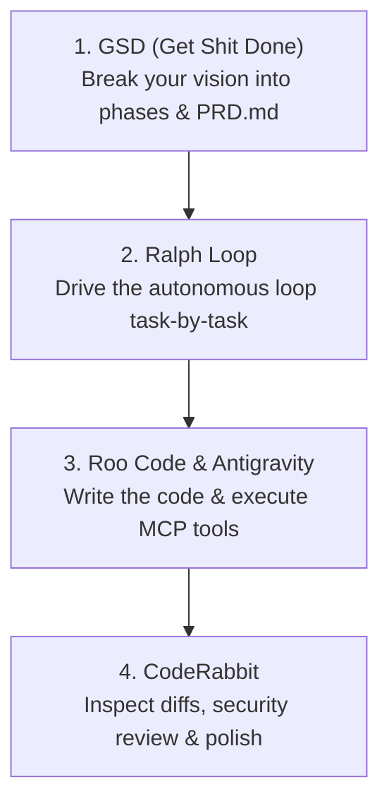
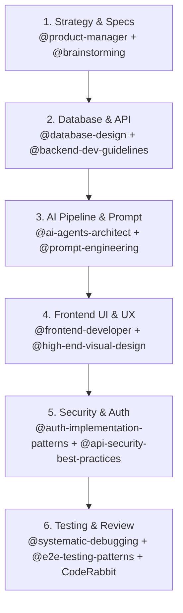

# 🚀 Antigravity Super-Tools User Guide
### Complete Setup & Usage Manual for GSD, Roo Code, CodeRabbit & Ralph Loop

This guide covers everything you need to know about the 4 tools installed in your **Antigravity IDE**, including setup details, use cases, UI locations, and step-by-step commands.

---

## 📑 Table of Contents
1. [Overview of the 4 Tools](#1-overview-of-the-4-tools)
2. [Get Shit Done (GSD) — Complete Guide](#2-get-shit-done-gsd--complete-guide)
   - [Why isn't GSD a sidebar extension?](#why-isnt-gsd-a-sidebar-extension)
   - [Fixing the `cannot read input file` error](#fixing-the-cannot-read-input-file-error)
   - [How to use GSD CLI (`gsd-sdk`)](#how-to-use-gsd-cli-gsd-sdk)
   - [How to use GSD inside Antigravity AI Chat](#how-to-use-gsd-inside-antigravity-ai-chat)
3. [Roo Code — The Autonomous Agent Sidebar](#3-roo-code--the-autonomous-agent-sidebar)
4. [CodeRabbit — AI Code Review & PR Assistant](#4-coderabbit--ai-code-review--pr-assistant)
5. [Ralph Loop — Infinite Context Loop Runner](#5-ralph-loop--infinite-context-loop-runner)
6. [The 4-Tool Synergy Workflow](#6-the-4-tool-synergy-workflow)
7. [Quick Command Cheat Sheet](#7-quick-command-cheat-sheet)
8. [Complete Encyclopedia of Installed Skills (29 Skills)](#8-complete-encyclopedia-of-installed-skills-29-skills)
   - [Full-Stack Engineering & Architecture](#-category-1-full-stack-engineering--architecture-7-skills)
   - [AI Products, LLMs & Autonomous Agents](#-category-2-ai-products-llms--autonomous-agents-9-skills)
   - [UI, UX & High-End Visual Design](#-category-3-ui-ux--high-end-visual-design-4-skills)
   - [Security, Auth & Data Protection](#-category-4-security-auth--data-protection-2-skills)
   - [Testing, QA & Debugging](#-category-5-testing-qa--debugging-3-skills)
   - [Product Strategy & Presentations](#-category-6-product-strategy--presentations-4-skills)
9. [How to Combine These Skills for Building Full-Stack AI Products](#9-how-to-combine-these-skills-for-building-full-stack-ai-products)

---

## 1. Overview of the 4 Tools

| Tool | Where it lives | What it does | Best Used For |
| :--- | :--- | :--- | :--- |
| **Get Shit Done (GSD)** | Global CLI (`gsd-sdk`) + 67 Agent Skills | Milestone engine & project scaffolding | High-level roadmap, phase breakdown, test generation, and autonomous planning |
| **Roo Code** | Antigravity Left Sidebar (Extension) | Multi-mode autonomous developer agent | Direct file creation, MCP tool execution, Architect/Code mode switching |
| **CodeRabbit** | Antigravity Editor / Source Control (Extension) | Automated inline code review & diff checker | Catching bugs, security audits, clean refactoring before committing code |
| **Ralph Loop** | Antigravity Sidebar & Command Palette (Extension) | Autonomous iteration runner using clean context windows | Running long tasks overnight without AI context decay or hallucinations |

---

## 2. Get Shit Done (GSD) — Complete Guide

### Why isn't GSD a sidebar extension?
GSD is **not** a traditional VS Code UI extension like a sidebar button. Instead, it is an **Autonomous Project Operating System**:
1. **67 Native Agent Skills**: Installed directly into your Antigravity agent core (`~/.gemini/antigravity/skills`). When you chat with Antigravity, it automatically knows how to execute GSD phases, code reviews, and audits.
2. **Terminal Engine (`gsd-sdk`)**: Available in your Antigravity terminal to orchestrate `.planning/` directories, workstreams, and autonomous lifecycles.

### Fixing the `cannot read input file` error
When you previously ran:
```powershell
gsd-sdk init @path/to/prd.md
```
It failed with `Cannot read input file "E:\SIH Shittt\path\to\prd.md"` because `@path/to/prd.md` was a **syntax placeholder** (an example path), not an actual file on your computer.

### How to use GSD CLI correctly:

#### Option A: Initialize with a Text Description (No file needed!)
You can initialize a project directly with quotes:
```powershell
gsd-sdk init "Build KalaSetu AI artisan marketplace with offline sync and voice assistant"
```

#### Option B: Initialize from an actual PRD file
> [!IMPORTANT]
> **Windows PowerShell Quoting Tip**: In PowerShell, the `@` symbol is reserved for splatting. You **must put quotes around `"@PRD.md"`**:
```powershell
# ✅ Correct in PowerShell:
gsd-sdk init "@PRD.md"

# ❌ Wrong (causes PowerShell error):
gsd-sdk init @PRD.md
```

#### Option C: Run Autonomous Execution
Once initialized, let GSD discover and run the milestone:
```powershell
gsd-sdk auto
```

#### Option D: Run a Specific Task or Feature Prompt
```powershell
gsd-sdk run "Create Supabase database schema for artisans and products"
```

> [!TIP]
> **Using GSD in Terminal vs in Antigravity Chat**:
> - **In Terminal (`gsd-sdk`)**: Uses the CLI runner (if it asks for `/login`, that is for Claude Code CLI).
> - **In Antigravity Chat (Easiest & Free)**: You don't need any Claude login! Because GSD's 67 skills are installed in Antigravity, you can simply tell Antigravity in the chat: *"Use GSD to plan the next phase of KalaSetu AI"* or *"Run a GSD code review on my files"*, and Antigravity handles everything using its built-in model!

---

### How to use GSD inside Antigravity AI Chat
Because GSD's 67 skills are installed globally into Antigravity, you can use GSD simply by chatting with Antigravity!

Try prompts like:
- *"Use GSD to plan the next phase of KalaSetu AI."*
- *"Run a GSD audit milestone on this workspace."*
- *"Use gsd-code-review on my frontend components."*
- *"Run gsd-new-milestone for offline multi-lingual speech recognition."*

Antigravity will invoke the appropriate `gsd-*` skills in the background automatically!

---

## 3. Roo Code — The Autonomous Agent Sidebar

### Where to Find It:
1. Look at the **Activity Bar** on the left edge of Antigravity IDE. Click the **Roo Code icon** (kangaroo/robot).
2. Or press `Ctrl + Shift + P`, type `Roo Code: Focus on View`, and press **Enter**.

### How to Use It:
1. **Select Mode**:
   - **Architect**: For high-level system design and asking questions before writing code.
   - **Code**: For active development, file writing, bug fixes, and testing.
   - **Ask**: For analyzing code and explaining architecture without modifying files.
2. **Configure Provider**:
   - Click the Settings gear in Roo Code.
   - Add your API Key (e.g., OpenRouter, Anthropic, Google Gemini, OpenAI, or local Ollama).
3. **Connect MCP Servers**:
   - Roo Code can directly call MCP tools (database queries, web scrapers, browser subagents).

---

## 4. CodeRabbit — AI Code Review & PR Assistant

### Where to Find It:
1. Press `Ctrl + Shift + P` and search for `CodeRabbit`.
2. Open the **Source Control (Git)** panel (`Ctrl + Shift + G`). CodeRabbit appears in the panel to review your changes before committing.

### How to Use It:
1. **Review Changed Files**:
   - Right-click any modified file or folder in your File Explorer and select **CodeRabbit: Review Code**.
2. **Review Diffs / Staged Changes**:
   - When preparing a git commit or pull request, click **CodeRabbit: Review Changes**.
3. **One-Click Refactors**:
   - CodeRabbit highlights edge-case vulnerabilities, performance bottlenecks, and syntax bugs with a single-click "Apply Fix" button.

---

## 5. Ralph Loop — Infinite Context Loop Runner

### What Problem Does It Solve?
Normal AI chats get slow, confused, or forgetful after long multi-turn sessions (known as *context decay*).
**Ralph Loop** solves this by running autonomous task cycles with a **fresh context window every iteration**, reading from `PRD.md` and logging to `progress.txt`.

### Where to Find It:
- Press `Ctrl + Shift + P` and type `Ralph Loop`.
- Look for the Ralph Loop icon on the Antigravity sidebar or status bar.

### How to Set Up Ralph Loop:
1. Create a `PRD.md` in your project root with your task list:
   ```markdown
   # Tasks
   - [ ] Build Supabase Auth integration
   - [ ] Add Multilingual Audio recording component
   - [ ] Implement Offline IndexedDB sync
   ```
2. Create an empty file `progress.txt` in your project root.
3. Open the command palette (`Ctrl + Shift + P`) -> **Ralph Loop: Start Loop**.
4. The agent will:
   - Read `PRD.md` to see what needs to be done.
   - Read `progress.txt` to see what is already done.
   - Implement the next item.
   - Check off the task in `PRD.md` and log details to `progress.txt`.
   - Clear its context memory and repeat the cycle for the next task!

---

## 6. The 4-Tool Synergy Workflow

Use all four tools together like a professional engineering pipeline:



1. **Plan with GSD**:
   Run `gsd-sdk init "My Project"` or ask Antigravity `Use GSD to plan milestone 1`.
2. **Execute with Ralph Loop & Roo Code**:
   Let Ralph Loop iterate through `PRD.md` with Roo Code / Antigravity doing the heavy coding.
3. **Review with CodeRabbit**:
   Run CodeRabbit on the modified files to ensure zero bugs and clean code quality.

---

## 7. Quick Command Cheat Sheet

| Task | Command / Action |
| :--- | :--- |
| **GSD Help** | `gsd-sdk --help` |
| **GSD Init with prompt** | `gsd-sdk init "Your project description"` |
| **GSD Init from file** | `gsd-sdk init "@PRD.md"` |
| **GSD Autonomous run** | `gsd-sdk auto` |
| **GSD Single Task** | `gsd-sdk run "Your task description"` |
| **Open Roo Code** | `Ctrl + Shift + P` -> `Roo Code: Focus on View` |
| **Trigger CodeRabbit** | Right click file -> `CodeRabbit: Review Code` |
| **Trigger Ralph Loop** | `Ctrl + Shift + P` -> `Ralph Loop: Start Loop` |

---

## 8. Complete Encyclopedia of Installed Skills (29 Skills)

All **29 high-impact skills** are installed globally in `~/.gemini/config/skills` and locally in `.agents/skills`.

To invoke any skill, type `@skill-name` in Antigravity chat or mention it naturally.

---

### 🌐 Category 1: Full-Stack Engineering & Architecture (7 Skills)

| Skill | Focus | What It Does & When to Use It | Copy-Paste Example Prompt |
| :--- | :--- | :--- | :--- |
| `@senior-fullstack` | System Architecture | **Use Case**: When architecting an entire project from database to frontend, making tech-stack decisions, or setting up cross-layer standards. | *"Use @senior-fullstack to architect the full data flow between Supabase, Next.js API routes, and our offline IndexedDB sync."* |
| `@backend-dev-guidelines` | Backend APIs & Services | **Use Case**: Production-grade Express / Next.js API handlers, middleware, request validation, database access patterns, and clean error handling. | *"Use @backend-dev-guidelines to write the REST API endpoint for artisan product uploads with image storage validation."* |
| `@database-design` | Database & SQL | **Use Case**: Designing PostgreSQL/Supabase tables, indexing strategy, foreign key relations, normalization, and migration scripts. | *"Use @database-design to build the complete Supabase schema for artisans, craft products, orders, and offline sync journals."* |
| `@api-patterns` | API Standards | **Use Case**: Designing consistent RESTful or RPC contracts, status codes, pagination, filtering, and payload formats. | *"Use @api-patterns to design our paginated search endpoint with multi-language query filters and sorting."* |
| `@frontend-developer` | React & Web Components | **Use Case**: Building modern React 19 / Next.js 15 UI components, managing client state, and connecting frontend to backend APIs. | *"Use @frontend-developer to code the dynamic product listing grid with real-time stock updates."* |
| `@react-best-practices` | Performance & Re-renders | **Use Case**: Eliminating unnecessary re-renders, optimizing hooks (`useMemo`, `useCallback`), and preventing memory leaks in audio/media. | *"Audit and optimize my custom audio recording hook using @react-best-practices."* |
| `@stripe-integration` | Monetization & Checkout | **Use Case**: Setting up checkout sessions, payment webhooks, subscription billing, and secure server-side verification. | *"Use @stripe-integration to implement the artisan payout and customer checkout flow with webhook handling."* |

---

### 🤖 Category 2: AI Products, LLMs & Autonomous Agents (9 Skills)

| Skill | Focus | What It Does & When to Use It | Copy-Paste Example Prompt |
| :--- | :--- | :--- | :--- |
| `@ai-agents-architect` | Agent System Design | **Use Case**: Building multi-agent systems, supervisor loops, memory management, tool calling, and planning strategies. | *"Use @ai-agents-architect to design an autonomous artisan onboarding agent that extracts craft details from voice notes."* |
| `@llm-app-patterns` | Production LLMs | **Use Case**: Structured JSON outputs, streaming responses, error retries, LLM fallback routing, and output verification. | *"Use @llm-app-patterns to build a resilient Gemini prompt pipeline that guarantees valid JSON output for product metadata."* |
| `@rag-engineer` | Vector Search & RAG | **Use Case**: Building Retrieval-Augmented Generation, vector embeddings, chunking documents, semantic search, and hybrid retrieval. | *"Use @rag-engineer to implement semantic search over thousands of handicraft stories and regional art styles using vector embeddings."* |
| `@prompt-engineering` | Robust Prompts | **Use Case**: Crafting production-grade system prompts, few-shot examples, chain-of-thought, and output boundary constraints. | *"Use @prompt-engineering to refine the prompt that transforms broken regional transcriptions into rich marketing stories."* |
| `@mcp-builder` | MCP Servers | **Use Case**: Building Model Context Protocol servers so LLMs can connect to external databases, filesystems, or third-party APIs. | *"Use @mcp-builder to create a custom MCP server that queries our Supabase artisan catalog directly from the agent."* |
| `@mcp-tool-developer` | MCP Tools & Schemas | **Use Case**: Writing type-safe tool definitions, argument schemas (Zod/JSON Schema), error handling, and testing MCP tools. | *"Use @mcp-tool-developer to write a tool schema for fetching real-time artisan craft prices."* |
| `@context-window-management` | Token & Context Health | **Use Case**: Preventing context decay, trimming token bloat, summarizing conversation history, and maintaining AI sharpness. | *"Use @context-window-management to design our chat session compression so long conversations never degrade in quality."* |
| `@ai-wrapper-product` | AI Product Market-Fit | **Use Case**: Turning raw AI APIs into products people will pay for, designing UI around AI latency, and handling streaming UX. | *"Use @ai-wrapper-product to review our value proposition and design the UI states for AI story generation."* |
| `@agent-evaluation` | Benchmarks & Accuracy | **Use Case**: Testing AI agent accuracy, measuring hallucinations, regression tests for prompt changes, and quality scorecards. | *"Use @agent-evaluation to create benchmark test cases comparing story outputs across different craft categories."* |

---

### 🎨 Category 3: UI, UX & High-End Visual Design (4 Skills)

| Skill | Focus | What It Does & When to Use It | Copy-Paste Example Prompt |
| :--- | :--- | :--- | :--- |
| `@frontend-design` | UI Component Layout | **Use Case**: Clean, responsive modern layouts, proper semantic HTML, and distinctive styling without generic templates. | *"Use @frontend-design to build the artisan profile header and craft gallery."* |
| `@high-end-visual-design` | Agency Visual Polish | **Use Case**: Adding visual wow-factor: glassmorphism, micro-animations, tailored color palettes, and luxury typography. | *"Use @high-end-visual-design to give our KalaSetu homepage an expensive, cultural artisan aesthetic."* |
| `@ui-ux-pro-max` | UX Flows & Journeys | **Use Case**: Frictionless user journeys, mobile-first layouts, form validation feedback, and accessible touch targets. | *"Use @ui-ux-pro-max to design the voice-to-listing multi-step wizard for low-literacy users."* |
| `@ui-a11y` | Accessibility & WCAG | **Use Case**: Ensuring WCAG 2.1 AA compliance, high contrast ratios, screen reader ARIA labels, and keyboard navigation. | *"Audit the entire navigation and button system with @ui-a11y for artisan accessibility."* |

---

### 🛡️ Category 4: Security, Auth & Data Protection (2 Skills)

| Skill | Focus | What It Does & When to Use It | Copy-Paste Example Prompt |
| :--- | :--- | :--- | :--- |
| `@auth-implementation-patterns` | Authentication & Sessions | **Use Case**: Phone OTP, session cookies, JWT verification, refresh tokens, and role-based access control (Admin vs Artisan vs Buyer). | *"Use @auth-implementation-patterns to implement secure Supabase phone number authentication with role checks."* |
| `@api-security-best-practices` | Threat Defense | **Use Case**: Input sanitization, SQL injection prevention, rate-limiting, CORS, and Row-Level Security (RLS) policies. | *"Audit our Supabase tables with @api-security-best-practices to ensure artisans can only edit their own listings."* |

---

### 🧪 Category 5: Testing, QA & Debugging (3 Skills)

| Skill | Focus | What It Does & When to Use It | Copy-Paste Example Prompt |
| :--- | :--- | :--- | :--- |
| `@systematic-debugging` | Root-Cause Analysis | **Use Case**: Finding and fixing complex, non-obvious bugs systematically without guessing or introducing regressions. | *"Use @systematic-debugging to diagnose why offline draft syncing fails when the network reconnects."* |
| `@e2e-testing-patterns` | End-to-End Testing | **Use Case**: Writing reliable Playwright / Cypress test suites that simulate complete user journeys from login to checkout. | *"Use @e2e-testing-patterns to write an automated test covering the entire voice recording and product creation flow."* |
| `@webapp-testing` | Local Web App Verification | **Use Case**: Testing local web apps, checking visual regression, verifying button clicks, and running browser checks. | *"Use @webapp-testing to test the checkout button responsiveness on mobile viewport."* |

---

### 📊 Category 6: Product Strategy & Presentations (4 Skills)

| Skill | Focus | What It Does & When to Use It | Copy-Paste Example Prompt |
| :--- | :--- | :--- | :--- |
| `@product-manager` | Product Strategy & Metrics | **Use Case**: Defining SaaS metrics, unit economics, go-to-market strategy, feature prioritization, and user personas. | *"Use @product-manager to formulate the business model and 32 key SaaS metrics for KalaSetu AI."* |
| `@brainstorming` | Creative Problem Solving | **Use Case**: Exploring unconventional angles, solving edge cases, and coming up with killer hackathon demo features. | *"Use @brainstorming to invent 3 high-impact offline engagement features that will impress SIH judges."* |
| `@pptx-official` | Pitch Decks & Slides | **Use Case**: Structuring slide layouts, visual hierarchy, judge-focused narratives, and speaker talking points. | *"Use @pptx-official to structure Slide 5 (Competitive Advantage) with clear bullet points and visual flow."* |
| `@pdf-official` | Documents & Reports | **Use Case**: Creating professional PDF summaries, invoices, pitch documents, and downloadable project reports. | *"Use @pdf-official to generate a clean downloadable project brief for investors."* |

---

## 9. How to Combine These Skills for Building Full-Stack AI Products

Here is how you chain these skills together to build end-to-end features:



---
*Guide generated for Antigravity IDE on Windows.*

